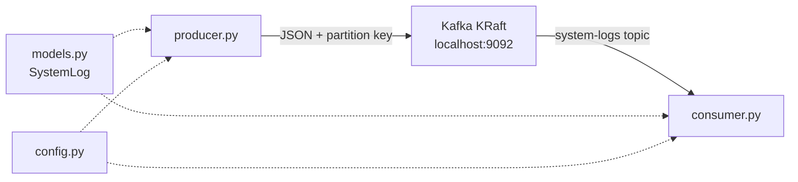

# Phase 1: Ingestion & Streaming

Phase 1 establishes the data engine: a local Kafka broker, a typed log contract, a mock producer, and a consumer that reads the stream with explicit offset control.

## Architecture



## 1.1 Kafka KRaft setup

**Choice:** Single-node KRaft (no ZooKeeper) via Confluent Platform image `confluentinc/cp-kafka:7.5.0`.

| Setting | Value | Rationale |
|---------|-------|-----------|
| `KAFKA_PROCESS_ROLES` | `broker,controller` | Combined broker + controller on one node for local dev |
| `KAFKA_NODE_ID` | `1` | Required KRaft node identifier |
| `CLUSTER_ID` | Static UUID | KRaft requires a fixed cluster ID on first boot |
| `KAFKA_ADVERTISED_LISTENERS` | `PLAINTEXT_HOST://localhost:9092` | Host clients connect on `localhost:9092` |
| `KAFKA_OFFSETS_TOPIC_REPLICATION_FACTOR` | `1` | Safe for single-broker local cluster |

**Why KRaft over ZooKeeper?** KRaft is the modern Kafka metadata layer. New deployments and learning projects should use it; ZooKeeper is deprecated in Kafka 3.x+.

**File:** `infrastructure/kafka/docker-compose.yml`

```bash
docker compose -f infrastructure/kafka/docker-compose.yml up -d
docker compose -f infrastructure/kafka/docker-compose.yml logs -f kafka
```

The broker auto-creates the `system-logs` topic on first produce (default `auto.create.topics.enable=true`).

## 1.2 Data contract

See [Data Contract](./data-contract.md) for the full `SystemLog` schema.

**Key files:**
- `src/models.py` — Pydantic model and `LogLevel` enum
- `src/config.py` — shared broker/topic/group constants

## 1.3 Python producer

**File:** `src/producer.py`

### Mock data strategy

The producer simulates a multi-service microservice environment:

| Service | Role in simulation |
|---------|-------------------|
| `payment-gateway` | Payment processing |
| `user-auth` | Authentication |
| `inventory-service` | Stock management |
| `frontend-bff` | Backend-for-frontend |

Log levels are weighted: `INFO` appears twice in the pool vs `WARN` and `ERROR` once each, producing a realistic ratio of normal operations to incidents.

`ERROR` events include a Faker-generated `stack_trace` (~200 chars) to exercise downstream error handling.

### Partition key

```python
key=log_entry.service_name.encode("utf-8")
```

**Why `service_name` as the key?** Kafka maps keys to partitions with `hash(key) % num_partitions`. All logs from the same service land on the same partition, preserving per-service ordering. This matters for incident correlation in later RAG phases.

### Async delivery

`confluent_kafka.Producer` is asynchronous. The producer calls:

- `producer.poll(0)` inside the loop to fire delivery callbacks
- `producer.flush()` in `finally` to drain in-flight messages on shutdown

Without `poll()`, delivery callbacks (and backpressure signals) would not run.

## 1.4 Python consumer

**File:** `src/consumer.py`

### Consumer group

| Setting | Value |
|---------|-------|
| `group.id` | `rag-ingestion-group` |
| `auto.offset.reset` | `earliest` |

`earliest` means a new group reads from the beginning of the topic. Once offsets are committed, restarts resume from the last committed position.

### Manual offset commits

**Choice:** `enable.auto.commit: False` with synchronous `consumer.commit()` after each successfully processed message.

| Approach | Behavior | When to use |
|----------|----------|-------------|
| Auto-commit (default) | Offsets committed on a timer, independent of processing success | Simple consumers where message loss on crash is acceptable |
| Manual commit | Offset committed only after validation + processing succeed | Pipelines where you must not lose or double-process messages |

Manual commit gives **at-least-once delivery**: a crash after processing but before commit causes redelivery. That is acceptable for Phase 1 and is the standard pattern before adding idempotency keys in Phase 2.

**Commit points:**

1. **Valid message** — validate with Pydantic, print, then `consumer.commit(message=msg, asynchronous=False)`.
2. **Invalid message (poison pill)** — log the `ValidationError`, commit to skip, continue. Prevents one bad record from stalling the group.

`asynchronous=False` ensures the commit is acknowledged before the next `poll()`, keeping the loop easy to reason about.

### Error output

`format_log()` prints the standard line for every message. When `log_level == ERROR` and `stack_trace` is present, the trace is printed on a second indented line:

```
[2026-07-11T13:05:12+00:00] ERROR - payment-gateway: Connection timeout to database for payment-gateway
  stack_trace: Traceback (most recent call last): ...
```

### PARTITION_EOF handling

`KafkaError._PARTITION_EOF` is not a failure — it signals the consumer reached the end of a partition. The loop continues polling for new messages.

## Shared configuration

`src/config.py` centralizes connection settings so producer and consumer cannot drift:

```python
KAFKA_BOOTSTRAP_SERVERS = "localhost:9092"
KAFKA_TOPIC_SYSTEM_LOGS = "system-logs"
KAFKA_CONSUMER_GROUP = "rag-ingestion-group"
```

When dockerizing in Phase 4, these become environment variables injected at runtime.

## Dependencies

Pinned in `requirements.txt`:

| Package | Version | Role |
|---------|---------|------|
| `confluent-kafka` | 2.15.0 | Official Confluent Python client (librdkafka bindings) |
| `pydantic` | 2.13.4 | Schema validation and JSON serialization |
| `Faker` | 40.28.1 | Realistic mock data for the producer |

**Why `confluent-kafka` over `kafka-python`?** The Confluent client wraps `librdkafka`, which is production-grade, supports advanced features (transactions, idempotence), and is the standard in industry deployments.

Install:

```bash
pip install -r requirements.txt
```

## Running end-to-end

Open three terminals:

```bash
# Terminal 1 — Kafka
docker compose -f infrastructure/kafka/docker-compose.yml up -d

# Terminal 2 — Producer
cd src
python producer.py

# Terminal 3 — Consumer
cd src
python consumer.py
```

Expected producer output:

```
Starting log stream... (Press Ctrl+C to stop)
Log sent to system-logs [2]
Log sent to system-logs [0]
...
```

Expected consumer output:

```
Listening on topic 'system-logs'...
[2026-07-11T13:05:12.345678+00:00] INFO - user-auth: Standard operation executed in 142ms
[2026-07-11T13:05:14.112233+00:00] ERROR - payment-gateway: Connection timeout to database for payment-gateway
  stack_trace: ...
```

Stop either script with `Ctrl+C`. The producer flushes pending messages; the consumer leaves the group cleanly via `consumer.close()`.

## Phase 1 checklist

- [x] **1.1** Kafka KRaft via Docker Compose
- [x] **1.2** Pydantic `SystemLog` data contract in `src/models.py`
- [x] **1.3** Mock producer with partition keys and async delivery
- [x] **1.4** Consumer with manual offset commits and Pydantic validation

## What comes next (Phase 2 preview)

The consumer in `src/consumer.py` is the insertion point for vector processing:

1. Replace `print(format_log(...))` with an embedding pipeline.
2. Keep manual commits — commit only after a successful vector DB write.
3. Reuse `SystemLog` to build the text chunk passed to the embedding model.

See the project roadmap for full Phase 2–4 goals.
