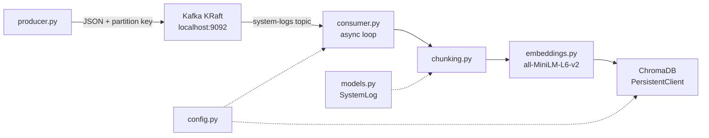

# Phase 2: Vector Processing

Phase 2 extends the Phase 1 consumer into an async embedding pipeline. Kafka messages are chunked, vectorized with a local Hugging Face model, and persisted in ChromaDB. Offsets are committed only after a successful vector write.

## Architecture




## 2.1 Vector database setup

**Choice:** Embedded ChromaDB via `PersistentClient` (no extra Docker service).


| Setting                  | Value                        | Rationale                                     |
| ------------------------ | ---------------------------- | --------------------------------------------- |
| `CHROMA_PERSIST_DIR`     | `{project_root}/data/chroma` | Persists vectors across restarts              |
| `CHROMA_COLLECTION_NAME` | `system-logs`                | Mirrors the Kafka topic for Phase 3 retrieval |
| ID strategy              | `event_id` (UUID)            | Idempotent upserts on Kafka redelivery        |


**File:** `src/vector_store.py`

- `get_collection()` — open or create the collection
- `upsert_log()` — write one embedding + metadata + document text
- `count()` / `query_similar()` — verification and future RAG queries

Data is stored under `data/chroma/` (gitignored).

## 2.2 Chunking strategy

**Choice:** One log entry = one chunk.

Mock logs are small (~50–250 tokens with stack traces). Per-message chunking keeps retrieval granular for incident analysis. The `chunking.py` module is designed so time-window or token-limit batching can be added later without rewriting the consumer.

### Embedding text format

`SystemLog.to_embedding_text()` produces:

```
[ERROR] payment-gateway @ 2026-07-11T13:05:12+00:00
Connection timeout to database for payment-gateway
stack_trace: Traceback (most recent call last): ...
```


### Metadata stored in Chroma


| Field          | Type   | Source                   |
| -------------- | ------ | ------------------------ |
| `service_name` | string | `SystemLog.service_name` |
| `log_level`    | string | `SystemLog.log_level`    |
| `timestamp`    | string | `SystemLog.timestamp`    |
| `partition`    | int    | Kafka message partition  |
| `offset`       | int    | Kafka message offset     |


### Idempotency

- Producer assigns `event_id` (UUID) at log creation time.
- Legacy messages without `event_id` fall back to `kafka-{partition}-{offset}`.
- Chroma `upsert` by ID prevents duplicates on redelivery.


## 2.3 Embedding generation

**Choice:** Local Hugging Face `sentence-transformers` (no API key).


| Setting    | Value                   |
| ---------- | ----------------------- |
| Model      | `all-MiniLM-L6-v2`      |
| Dimensions | 384                     |
| Library    | `sentence-transformers` |


**File:** `src/embeddings.py`

The model is lazy-loaded on the first `embed()` call. The first run downloads ~80MB; subsequent runs use the Hugging Face cache.

## 2.4 Asynchronous ingestion

**File:** `src/consumer.py`

The consumer uses `asyncio` with `asyncio.to_thread()` to offload blocking work:

1. `poll()` Kafka message (synchronous — `confluent_kafka` is not async-native)
2. Validate with Pydantic (poison pills are committed and skipped)
3. Build `LogChunk` via `chunking.py`
4. Embed text in a worker thread
5. Upsert to Chroma in a worker thread
6. Commit offset only after step 5 succeeds

On embedding or DB failure, the offset is **not** committed. The message is redelivered (at-least-once semantics).

## Dependencies

Added to `requirements.txt`:


| Package                 | Role                     |
| ----------------------- | ------------------------ |
| `chromadb`              | Embedded vector database |
| `sentence-transformers` | Local embedding model    |


Install (from project root):

```bash
pip install -r requirements.txt
```


## Running end-to-end

Open three terminals:

```bash
# Terminal 1 — Kafka
docker compose -f infrastructure/kafka/docker-compose.yml up -d

# Terminal 2 — Producer
.\.venv\Scripts\Activate.ps1
cd src
python producer.py

# Terminal 3 — Consumer (downloads model on first run)
.\.venv\Scripts\Activate.ps1
cd src
python consumer.py
```

Expected consumer output:

```
Listening on topic 'system-logs'...
Ingested 3f2a1b4c-... [ERROR] payment-gateway: Connection timeout to database for payment-gateway
Ingested 8d9e0f1a-... [INFO] user-auth: Standard operation executed in 142ms
...
```


### Verify Chroma contents

```bash
cd src
python -c "from vector_store import get_collection; c = get_collection(); print('count:', c.count()); print(c.peek(3))"
```


### Query similar logs

```python
from embeddings import HuggingFaceEmbedder
from vector_store import query_similar

embedder = HuggingFaceEmbedder()
results = query_similar(embedder.embed("database connection timeout"), k=3)
print(results["documents"])
print(results["metadatas"])
```


## Phase 2 checklist

- [x] **2.1** ChromaDB embedded setup via `vector_store.py`
- [x] **2.2** Per-message chunking with `chunking.py` and `to_embedding_text()`
- [x] **2.3** Hugging Face embeddings via `embeddings.py`
- [x] **2.4** Async consumer with commit-after-write


## What comes next (Phase 3 preview)

Phase 3 will add a FastAPI backend and LangGraph agent that calls `vector_store.query_similar()` as a retrieval tool for incident analysis.